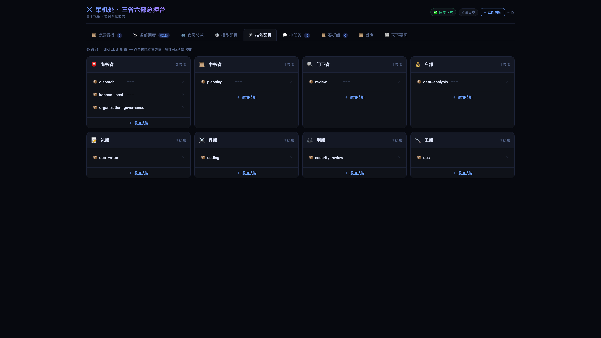
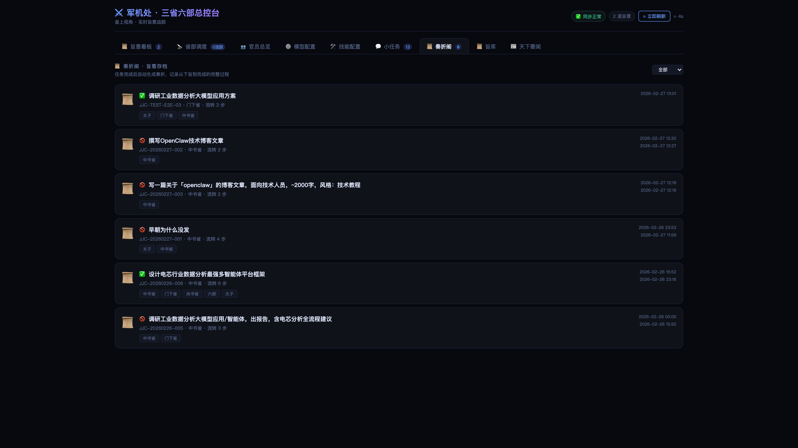
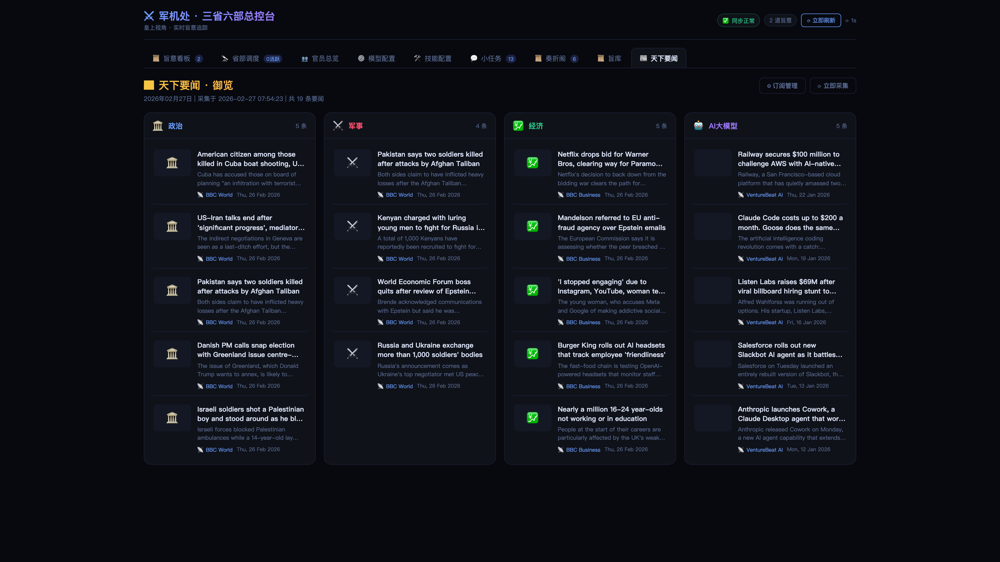

<h1 align="center">⚔️ Tang Political System · 大唐政治体制</h1>

<p align="center">
  <strong>AI Multi-Agent Collaboration System Based on Three Departments & Six Ministries Architecture · Windows Optimized</strong>
</p>

<p align="center">
  <sub>10 AI Agents form the Three Departments and Six Ministries: Zhongshu for sorting and planning, Menxia for review and veto, Shangshu for dispatch, Six Ministries + Libu HR for parallel execution.<br>One more layer of <b>institutional review</b> than CrewAI, one more <b>real-time dashboard</b> than AutoGen.</sub>
</p>

<p align="center">
  <sub>This project is based on <a href="https://github.com/cft0808/edict">cft0808/edict (Three Departments & Six Ministries)</a>, focused on Windows compatibility optimization</sub>
</p>

<p align="center">
  <a href="#-architecture">🏛️ Architecture</a> ·
  <a href="#-feature-overview">📋 Dashboard Features</a> ·
  <a href="docs/task-dispatch-architecture.md">📚 Architecture Docs</a> ·
  <a href="README.md">中文</a> ·
  <a href="CONTRIBUTING.md">Contribute</a>
</p>

<p align="center">
  <strong>📖 Recommended Reading:</strong>
  <a href="docs/background-zh.md">Project Background (Chinese)</a> ·
  <a href="docs/background-en.md">Project Background (English)</a>
</p>

<p align="center">
  
  
  
  
  
  
  
</p>

---

## 📖 Project Background (Recommended Reading)

> **First time using this project? We recommend reading the background documentation to understand the design philosophy and historical origins.**

<div align="center">

| Document | Language | Description |
|:---:|:---:|:---|
| [📜 Project Background](docs/background-zh.md) | Chinese | Learn about the historical origins of the Three Departments system, design philosophy, and its relevance to modern AI governance |
| [📜 Project Background](docs/background-en.md) | English | Learn about the historical origins of the Three Departments system and its relevance to modern AI governance |

</div>

**Core Insight**: We have transformed the **Three Departments & Six Ministries system** from China's Tang Dynasty (618-907 AD), which lasted for 1,400 years, into a governance framework for modern AI multi-agent collaboration systems. This is not simply cultural packaging, but a modernization of ancient wisdom regarding **separation of powers, checks and balances, and procedural governance**.

---

## 🤔 Why Three Departments & Six Ministries?

Most Multi-Agent frameworks follow this pattern:

> *"Alright, you AIs talk among yourselves, then give me the result when you're done."*

Then you receive a blob of output with no idea what processing it went through—non-reproducible, non-auditable, non-intervenable.

**The Three Departments & Six Ministries approach is completely different** — we use a governmental architecture that existed in China for 1,400 years:

```
You (Emperor) → Zhongshu (Sorting + Planning) → Menxia (Review) → Shangshu (Dispatch) → Six Ministries (Execution) → Report Back
```

This is not a fancy metaphor—this is **true separation of powers**:

| | CrewAI | MetaGPT | AutoGen | **Three Departments & Six Ministries** |
|---|:---:|:---:|:---:|:---:|
| **Review Mechanism** | ❌ None | ⚠️ Optional | ⚠️ Human-in-loop | **✅ Menxia Dedicated Review · Veto Power** |
| **Real-time Dashboard** | ❌ | ❌ | ❌ | **✅ Military Command Kanban + Timeline** |
| **Task Intervention** | ❌ | ❌ | ❌ | **✅ Pause / Cancel / Resume** |
| **Process Audit** | ⚠️ | ⚠️ | ❌ | **✅ Complete Memorial Archive** |
| **Agent Health Monitoring** | ❌ | ❌ | ❌ | **✅ Heartbeat + Activity Detection** |
| **Hot-swap Models** | ❌ | ❌ | ❌ | **✅ One-click LLM Switch in Dashboard** |
| **Skill Management** | ❌ | ❌ | ❌ | **✅ View / Add Skills** |
| **News Aggregation** | ❌ | ❌ | ❌ | **✅ Morning Briefing + Feishu Push** |
| **Deployment Difficulty** | Medium | High | Medium | **Low · One-click Install / Docker** |

> **Core Difference: Institutional Review + Full Observability + Real-time Intervention**

<details>
<summary><b>🔍 Why "Menxia Review" is the Killer Feature? (Click to expand)</b></summary>
<br>

CrewAI and AutoGen's Agent collaboration model is **"submit when done"**—no one checks the output quality. It's like a company without a QA department, where engineers deploy code directly after writing it.

The **Menxia (门下省)** in the Three Departments & Six Ministries system is specifically designed for this:

- 📋 **Review Plan Quality** — Is Zhongshu's planning complete? Are sub-tasks reasonably broken down?
- 🚫 **Veto Unqualified Output** — Not just a warning, but direct rejection for rework
- 🔄 **Mandatory Rework Loop** — Until the plan meets standards before proceeding

This is not an optional plugin—**it is part of the architecture**. Every imperial edict must pass through Menxia, no exceptions.

This is why the Three Departments & Six Ministries can handle complex tasks with reliable results: because there is a mandatory quality checkpoint before reaching the execution layer. Emperor Taizong of Tang figured this out 1,300 years ago—**unchecked power inevitably leads to errors**.

</details>

---

## ✨ Feature Overview

### 🏛️ Ten-Ministry Agent Architecture
- **Three Departments** (Zhongshu · Menxia · Shangshu) responsible for planning, review, and dispatch
- **Seven Ministries** (Hu · Li · Bing · Xing · Gong · Li HR + Zaochao) responsible for specialized execution
- Strict permission matrix — who can message whom, in black and white
- Each Agent has independent Workspace · independent Skills · independent model
- **Edict Data Cleaning** — Automatic stripping of file paths, metadata, and invalid prefixes from titles/notes

### 📋 Military Command Dashboard (10 Functional Panels)

<table>
<tr><td width="50%">

**📋 Edict Kanban**
- Display all tasks by status column
- Province/Ministry filtering + full-text search
- Heartbeat badges (🟢Active 🟡Stalled 🔴Alert)
- Task details + complete process chain
- Pause / Cancel / Resume operations

</td><td width="50%">

**🔭 Department Dispatch Monitor**
- Visualize task counts by status
- Horizontal bar chart of department distribution
- Real-time Agent health status cards

</td></tr>
<tr><td>

**📜 Memorial Hall**
- Auto-archive completed edicts as memorials
- Five-stage timeline: Edict→Zhongshu→Menxia→Shangshu→Six Ministries→Report
- One-click copy as Markdown
- Filter by status

</td><td>

**📜 Edict Library**
- 9 preset edict templates
- Category filtering · parameter forms · time/cost estimation
- Preview edict → Issue with one click

</td></tr>
<tr><td>

**👥 Officials Overview**
- Token consumption leaderboard
- Activity · completion count · session statistics

</td><td>

**📰 Morning Briefing**
- Daily automatic collection of tech/finance news
- Category subscription management + Feishu push

</td></tr>
<tr><td>

**⚙️ Model Configuration**
- Independent LLM switching for each Agent
- Auto-restart Gateway after application (~5 seconds to take effect)

</td><td>

**🛠️ Skills Configuration**
- Overview of installed Skills for each Province/Ministry
- View details + add new skills

</td></tr>
<tr><td>

**💬 Quick Tasks / Sessions**
- OC-* session real-time monitoring
- Source channel · heartbeat · message preview

</td><td>

**🎬 Morning Ceremony**
- Play opening animation on first daily visit
- Today's stats · auto-disappear after 3.5 seconds

</td></tr>
</table>

---

## 🖼️ Screenshots

### Edict Kanban


<details>
<summary>📸 Click to view more screenshots</summary>

### Department Dispatch Monitor


### Task Process Details


### Model Configuration


### Skills Configuration


### Officials Overview


### Session Records


### Memorial Archive


### Edict Templates


### Morning Briefing


### Morning Ceremony


</details>

---

## 🚀 Quick Deployment

### 🤖 Method 1: Let Claw Deploy for You (Recommended, Easiest)

<div align="center">

**If you're using OpenClaw, simply send this message to your Claw:**

```
https://github.com/838997125/Tang-Political-System.git Download this project to D:\tools directory and install it
```

**Claw will help you complete:**

✅ Auto-clone project → ✅ Detect and install dependencies → ✅ Run install script → ✅ Configure 10 Agents → ✅ Start system

</div>

<details>
<summary><b>💡 Click for detailed instructions (optional)</b></summary>

**Command format:**
```
https://github.com/838997125/Tang-Political-System.git Download this project to <your-directory> directory and install it
```

**Examples:**
- Windows: `https://github.com/838997125/Tang-Political-System.git Download this project to D:\tools directory and install it`
- macOS/Linux: `https://github.com/838997125/Tang-Political-System.git Download this project to ~/projects directory and install it`

</details>

---

### 🔗 Integration with Existing Agents

If you already have an OpenClaw Agent (such as `main`), you can integrate with Tang Political System through **activation keywords**:

**Add to `main`'s SOUL.md:**
```markdown
## Tang Political System Activation Rules

### Emperor Exclusive (Forward to zhongshu)
Keywords: 朕 (I/Emperor), 圣旨 (Imperial Edict), 下旨 (Issue Edict), 传旨 (Transmit Edict), 口谕 (Verbal Order)

### Direct Department Dispatch (Forward to corresponding department)
中书省 (Zhongshu), 门下省 (Menxia), 尚书省 (Shangshu), 户部 (Hubu), 礼部 (Libu), 兵部 (Bingbu), 刑部 (Xingbu), 工部 (Gongbu), 吏部 (Libu HR), 早朝官 (Zaochao)

### Direct Functions
军机处/看板 (Military Command/Kanban), 奏折 (Memorials), 上朝 (Start Court), 退朝 (End Court)

### Quick Commands
宣 + Department Name (Summon + Department Name)
```

**Configure permissions:**
```json
"main": {
  "subagents": {
    "allowAgents": ["emperor",
            "zhongshu",
            "menxia",
            "shangshu",
            "hubu",
            "libu",
            "bingbu",
            "xingbu",
            "gongbu",
            "libu_hr",
            "zaochao"]
  }
}
```

**Workflow:**

```
User Message → main detects keywords → Forward to zhongshu → Zhongshu plans → Six Ministries execute
```

**Examples:**
- `"朕要做一个竞品分析" (I want a competitive analysis)` → main → zhongshu → Three Departments & Six Ministries process
- `"普通消息" (Normal message)` → main handles directly

---

### 🧠 Intelligent Agent Configuration (Auto-detection)

The `install.ps1` script will **automatically detect** your OpenClaw configuration and intelligently integrate Tang Political System:

#### Single Agent Configuration

**Scenario:** Your OpenClaw has 0 or 1 agent

**Script behavior:**
1. **Create `main` agent** (if not exists)
2. **Workspace points to** your default workspace (`agents.defaults.workspace`)
3. **AgentDir points to** `$OC_HOME\agents\main\agent`
4. **Configure permissions:**
   ```json
   {
     "id": "main",
     "workspace": "C:\\Users\\<user>\\.openclaw\\workspace",
     "agentDir": "C:\\Users\\<user>\\.openclaw\\agents\\main\\agent",
     "subagents": {
       "allowAgents": ["emperor",
               "zhongshu",
               "menxia",
               "shangshu",
               "hubu",
               "libu",
               "bingbu",
               "xingbu",
               "gongbu",
               "libu_hr",
               "zaochao"]
     }
   }
   ```
5. **Write to SOUL.md:** Automatically add Tang Political System activation rules

**Advantage:** Maintains your existing workspace and configuration, zero migration cost

#### Multi-Agent Configuration

**Scenario:** Your OpenClaw already has multiple agents

**Script behavior:**
1. **Select the first agent** as the entry point for Tang Political System
2. **Add call permissions:**
   ```json
   {
     "subagents": {
       "allowAgents": ["emperor",
               "zhongshu",
               "menxia",
               "shangshu",
               "hubu",
               "libu",
               "bingbu",
               "xingbu",
               "gongbu",
               "libu_hr",
               "zaochao"]
     }
   }
   ```
3. **Update SOUL.md:** Append activation rules to the first agent's SOUL.md

**Advantage:** Does not disrupt existing agents, only enhances the first agent's capabilities

#### Configuration Detection Logic

```powershell
# Script internal logic
$agentsList = $cfg.agents.list
$agentCount = $agentsList.Count

if ($agentCount -le 1) {
    # Single Agent Mode
    $ConfigMode = "SINGLE"
    # Create or configure main agent
} else {
    # Multi-Agent Mode
    $ConfigMode = "MULTI"
    # Configure the first agent
}
```

#### Tang Political System Activation Rules

After installation, your main/first agent will automatically gain the following capabilities:

| Keywords | Calls Agent | Purpose |
|--------|-----------|------|
| `朕`, `圣旨`, `下旨`, `传旨`, `口谕` | zhongshu | Emperor exclusive, forward to Zhongshu |
| `中书省` | zhongshu | Planning, sorting |
| `门下省` | menxia | Review, audit |
| `尚书省` | shangshu | Dispatch, coordinate |
| `户部` | hubu | Data, reports |
| `礼部` | libu | Documentation, standards |
| `兵部` | bingbu | Code, engineering |
| `刑部` | xingbu | Security, audit |
| `工部` | gongbu | Deployment, tools |
| `吏部` | libu_hr | HR, management |
| `早朝官` | zaochao | Reporting, briefing |
| `军机处`/`看板` | - | Return Kanban URL |
| `奏折` | - | Query completed tasks |
| `官员` | - | Query Agent status |
| `上朝` | - | Start services |
| `退朝` | - | Stop services |

---

### 📦 Method 2: Manual Installation

<details>
<summary><b>🪟 Windows Installation (Click to expand)</b></summary>

#### ⚠️ Important Notice

The installation script will modify your OpenClaw configuration file `openclaw.json`, including:
- ✅ Auto-backup original configuration to `openclaw.json.bak.YYYYMMDD-HHMMSS`
- ✅ Add 10 Agents (Zhongshu, Menxia, Shangshu, Six Ministries, Libu HR, Zaochao)
- ✅ Configure permission matrix between Agents
- ✅ Restart Gateway to apply configuration

**Recommendation: Backup your configuration before installation, or ensure you understand these modifications.**

#### Prerequisites

<details>
<summary><b>📋 Click for detailed installation guide (Click to expand)</b></summary>

**1. Windows 10/11 (64-bit)**
- Ensure system is 64-bit version

**2. Python 3.9+**
- Download: https://www.python.org/downloads/
- ⚠️ **Be sure to check "Add Python to PATH" during installation**
- Verify installation: Open PowerShell and run `python --version` or `py --version`

**3. OpenClaw CLI**
- Official site: https://openclaw.ai
- Installation guide: https://docs.openclaw.ai/getting-started
- Run `openclaw` after installation to complete initial configuration
- Verify installation: Run `openclaw --version`

**4. Node.js 18+** (Optional)
- Install Node.js if you need to build the frontend
- Download: https://nodejs.org/

**5. PowerShell**
- Windows 10/11 comes with PowerShell 5.1+
- Or install PowerShell 7: https://aka.ms/powershell

</details>

- Windows 10/11 (64-bit)
- [Python 3.9+](https://www.python.org/downloads/) ⚠️ Check "Add Python to PATH" during installation
- [Node.js 18+](https://nodejs.org/) (Optional, for building frontend)
- [OpenClaw CLI](https://openclaw.ai) installed and initialized ([Installation Guide](https://docs.openclaw.ai/getting-started))
- PowerShell 5.1+ or PowerShell 7+

#### Install Dependencies

```powershell
# Install Python dependencies
pip install psutil
```

> **Note:** `<PROJECT_DIR>` in the documentation represents the directory path where you downloaded the project. Replace it with your actual path.
> For example: `D:\tools\Tang-Political-System` or `C:\Users\YourName\Projects\Tang-Political-System`

#### Run Installation Script

> **💡 Tip:** `<PROJECT_DIR>` is the directory where you cloned the project, e.g., `D:\tools\Tang-Political-System` or `C:\Users\YourName\Projects\Tang-Political-System`

**Direct use of PowerShell**

```powershell
# Enter project directory (replace <PROJECT_DIR> with your actual path)
cd <PROJECT_DIR>

# Run installation script (requires administrator privileges)
.\install.ps1
```

The installation script automatically completes:
- ✅ Create 10 Agent Workspaces (Three Departments/Six Ministries/Libu HR/Zaochao)
- ✅ Write SOUL.md for each Province/Ministry (role persona + workflow rules)
- ✅ Register Agents and permission matrix to `openclaw.json`
- ✅ Initialize data directories
- ✅ Execute first data synchronization
- ✅ Restart Gateway

#### Start System

> **💡 Tip:** The following commands need to be executed in the project directory `<PROJECT_DIR>`

**Method 1: Background Start (Recommended)**

Use `scripts\start-background.ps1` script to start all services in the background without occupying the foreground window:

```powershell
# Enter project directory
cd <PROJECT_DIR>

# Start all services in background
.\start_server.ps1

# View logs
Get-Content logs\dashboard_server.log -Tail 20

# Stop all services
.\stop_server.ps1
```

**Method 2: Start Separately**

If you need to control the two services separately, you can start them manually:

```powershell
# Enter project directory
cd <PROJECT_DIR>

# Terminal 1: Start data refresh loop (keep running)
.\scripts\run_loop.ps1

# Terminal 2: Start dashboard server (keep running)
python dashboard\server.py
```

#### Access Dashboard

After successful startup, open your browser and visit: http://127.0.0.1:7891

> If port 7891 is occupied, you can modify `DASHBOARD_PORT` in the `.env` file

#### ⚠️ Troubleshooting

<details>
<summary><b>🔴 Execution Policy Error (Click to expand)</b></summary>
**Solution 1: Temporarily allow current session**

```powershell
Set-ExecutionPolicy -ExecutionPolicy Bypass -Scope Process
.\install.ps1
```

**Solution 2: Check current execution policy**

```powershell
Get-ExecutionPolicy
Set-ExecutionPolicy -ExecutionPolicy RemoteSigned -Scope CurrentUser
```

</details>

<details>
<summary><b>🔴 Dependency Not Found (Click to expand)</b></summary>
**OpenClaw CLI Not Found**

```powershell
# Visit https://openclaw.ai to install
# Run initialization after installation
openclaw
```

**Python Not Found**
```powershell
# Install Python 3.9+ from https://www.python.org/downloads/
# Check "Add Python to PATH" during installation
```

**openclaw.json Not Found**
```powershell
# Run OpenClaw initialization
openclaw
```

</details>

<details>
<summary><b>🔴 Gateway Restart Failed (Click to expand)</b></summary>

**Possible reasons:**
1. OpenClaw Gateway is not running
2. Insufficient privileges (try running as administrator)
3. Port is occupied (default 18789)

**Troubleshooting steps:**

```powershell
# 1. Check Gateway status
openclaw gateway status

# 2. Manually start Gateway
openclaw gateway start

# 3. View log files
Get-Content $env:LOCALAPPDATA\Temp\openclaw\openclaw-*.log | Select-Object -Last 50

# 4. Check port occupation
netstat -ano | findstr :18789
```

**If Gateway fails to start:**
- Configuration has been saved, will take effect automatically after Gateway starts
- You can skip Gateway restart and start manually later:
  ```powershell
  .\install.ps1 -SkipGatewayRestart
  ```

</details>

📖 [View Complete Troubleshooting Guide](docs/windows-troubleshooting.md)

#### Uninstall

If you need to uninstall Tang Political System:

```powershell
# Run uninstall script
.\uninstall.ps1

# Or use parameters
.\uninstall.ps1 -Force         # Skip confirmation prompts
.\uninstall.ps1 -KeepBackup    # Keep backup files
```

The uninstall script will:
- Remove the 10 added Agents from `openclaw.json`
- Optionally restore the pre-installation configuration backup
- Delete workspace directories
- Restart Gateway

For more Windows installation details, see [Windows Installation Guide](docs/windows-install.md).

</details>

> 💡 **Dashboard ready to use**: `server.py` embeds `dashboard/dashboard.html`, Docker image includes pre-built React frontend

> 💡 For detailed tutorials, see [Getting Started Guide](docs/getting-started.md)

---

## 🏛️ Architecture

```
                           ┌───────────────────────────────────┐
                           │          👑 Emperor (You)         │
                           │     Feishu · Telegram · Signal    │
                           └─────────────────┬─────────────────┘
                                             │ Issue Edict
                           ┌─────────────────▼─────────────────┐
                           │       📜 Zhongshu (zhongshu)      │
                           │  Receive & Sort: Chat auto-reply  │
                           │       Plan → Break down tasks     │
                           └─────────────────┬─────────────────┘
                                             │ Submit for Review
                           ┌─────────────────▼─────────────────┐
                           │        🔍 Menxia (menxia)         │
                           │    Review Plan → Approve / Veto   │
                           └─────────────────┬─────────────────┘
                                             │ Approved ✅
                           ┌─────────────────▼─────────────────┐
                           │       📮 Shangshu (shangshu)      │
                           │   Dispatch → Coordinate → Report  │
                           └───┬──────┬──────┬──────┬──────┬───┘
                               │      │      │      │      │
                         ┌─────▼┐ ┌───▼───┐ ┌▼─────┐ ┌───▼─┐ ┌▼─────┐
                         │💰 Hubu│ │📝 Libu│ │⚔️ Bingbu│ │⚖️ Xingbu│ │🔧 Gongbu│
                         │ Data │ │ Docs  │ │Engineering│ │Security │ │Infrastructure│
                         └──────┘ └──────┘ └──────┘ └─────┘ └──────┘
                                                               ┌──────┐
                                                               │📋 Libu HR│
                                                               │  HR  │
                                                               └──────┘
```

### Department Responsibilities

| Department | Agent ID | Responsibility | Expertise |
|------|----------|------|---------|
| 📜 **Zhongshu** | `zhongshu` | Receive, sort, plan, break down | Message sorting, requirement understanding, task decomposition, solution design |
| 🔍 **Menxia** | `menxia` | Review, approve/dispatch, veto | Quality review, risk identification, standard enforcement, post-review dispatch to Shangshu |
| 📮 **Shangshu** | `shangshu` | Dispatch, coordinate, summarize | Task scheduling, progress tracking, result integration |
| 💰 **Hubu** | `hubu` | Data, resources, accounting | Data processing, report generation, cost analysis |
| 📝 **Libu** | `libu` | Documentation, standards, reports | Technical docs, API docs, standard formulation |
| ⚔️ **Bingbu** | `bingbu` | Code, algorithms, inspection | Feature development, bug fixes, code review |
| ⚖️ **Xingbu** | `xingbu` | Security, compliance, audit | Security scanning, compliance checks, red-line enforcement |
| 🔧 **Gongbu** | `gongbu` | CI/CD, deployment, tools | Docker config, pipelines, automation |
| 📋 **Libu HR** | `libu_hr` | HR, Agent management | Agent registration, permission maintenance, training |
| 🌅 **Zaochao** | `zaochao` | Daily briefing, news aggregation | Scheduled broadcasts, data summaries |

### Permission Matrix

> Not free to message — true separation of powers and checks

| From ↓ \ To → | Zhongshu | Menxia | Shangshu | Hu | Li | Bing | Xing | Gong | Li HR |
|:---:|:---:|:---:|:---:|:---:|:---:|:---:|:---:|:---:|:---:|
| **Zhongshu** | — | ✅ | ✅ |  | | | | | |
| **Menxia** | ✅ | — | ✅ |  | | | | | |
| **Shangshu** | ✅ | — | — | ✅ | ✅ | ✅ | ✅ | ✅ | ✅ |
| **Six Ministries + Li HR** | | | ✅ |  | | | | | |

> **Permission Explanation:**
>
> - **Zhongshu**: Only scheduling center, can submit to Menxia for review, can directly dispatch to Shangshu for execution
> - **Menxia**: After review **approve → dispatch to Shangshu for execution**, **veto → return to Zhongshu for replanning**
> - **Shangshu**: Can coordinate Six Ministries for execution, can return to Menxia when vetoed, report back to Zhongshu after completion
> - **Six Ministries + Li HR**: Can only report back to Shangshu, cannot communicate directly across departments

### Task Status Flow

```
Emperor → Zhongshu Sorting/Planning → Menxia Review → Dispatched → Executing → Pending Review → ✅ Completed
                      ↑          │                              │
                      └──── Veto ─┘                    Blocked
```

---

## 📁 Project Structure

```
edict/
├── agents/                     # 9 Agent persona templates
│   ├── zhongshu/SOUL.md        # Zhongshu · Planning Center
│   ├── menxia/SOUL.md          # Menxia · Review Gatekeeper
│   ├── shangshu/SOUL.md        # Shangshu · Dispatch Brain
│   ├── hubu/SOUL.md            # Hubu · Data Resources
│   ├── libu/SOUL.md            # Libu · Documentation Standards
│   ├── bingbu/SOUL.md          # Bingbu · Engineering Implementation
│   ├── xingbu/SOUL.md          # Xingbu · Compliance Audit
│   ├── gongbu/SOUL.md          # Gongbu · Infrastructure
│   ├── libu_hr/                # Libu HR · Personnel Management
│   └── zaochao/SOUL.md         # Zaochao · Intelligence Hub
├── dashboard/
│   ├── dashboard.html          # Military Command Dashboard (single file · zero dependency · ~2500 lines)
│   ├── dist/                   # React frontend build output (included in Docker image, optional locally)
│   └── server.py               # API server (Python stdlib · zero dependency · ~1200 lines)
├── scripts/
│   ├── run_loop.sh             # Data refresh loop (every 15 seconds)
│   ├── kanban_update.py        # Kanban CLI (includes edict data cleaning + title validation)
│   ├── skill_manager.py        # Skill management tool (remote/local Skills add, update, remove)
│   ├── sync_from_openclaw_runtime.py
│   ├── sync_agent_config.py
│   ├── sync_officials_stats.py
│   ├── fetch_morning_news.py
│   ├── refresh_live_data.py
│   ├── apply_model_changes.py
│   └── file_lock.py            # File lock (prevent multi-Agent concurrent writes)
├── tests/
│   └── test_e2e_kanban.py      # End-to-end test (17 assertions)
├── data/                       # Runtime data (gitignored)
├── docs/
│   ├── task-dispatch-architecture.md  # 📚 Detailed architecture docs: complete design of task dispatch, flow, and scheduling (business + technical)
│   ├── getting-started.md             # Quick start guide
│   ├── wechat-article.md              # WeChat article
│   └── screenshots/                   # Feature screenshots (11 images)
├── install.sh                  # One-click installation script
├── CONTRIBUTING.md             # Contribution guide
└── LICENSE                     # MIT License
```

---

## 🎯 Usage

### Issue Edict to AI

Send messages to Zhongshu via Feishu / Telegram / Signal:

```
Edict: Design a user registration system for me, requirements:
1. RESTful API (FastAPI)
2. PostgreSQL database
3. JWT authentication
4. Complete test cases
5. Deployment documentation
```

**Then sit back and watch:**

1. 📜 Zhongshu receives edict, plans sub-task allocation
2. 🔍 Menxia reviews, approves / vetoes and returns for replanning
3. 📮 Shangshu approves, dispatches to Bingbu + Gongbu + Libu
4. ⚔️ Ministries execute in parallel, progress visible in real-time
5. 📮 Shangshu summarizes results, reports back to you

The entire process can be monitored in real-time on the **Military Command Dashboard**, and you can **pause, cancel, or resume** at any time.

### Use Edict Templates

> Dashboard → 📜 Edict Library → Select template → Fill parameters → Issue edict

9 preset templates: Weekly report generation · Code review · API design · Competitive analysis · Data report · Blog post · Deployment plan · Email copy · Standup summary

### Customize Agents

Edit `agents/<id>/SOUL.md` to modify Agent's persona, responsibilities, and output specifications.

### Add Skills (Connect from Internet)

**Three ways to add Skills:**

#### 1️⃣ Dashboard UI (Easiest)

```
Dashboard → 🔧 Skills Configuration → ➕ Add Remote Skill
→ Enter Agent + Skill Name + GitHub URL
→ Confirm → ✅ Complete
```

#### 2️⃣ CLI Commands (Most Flexible)

```bash
# Add code_review skill from GitHub to Zhongshu
python3 scripts/skill_manager.py add-remote \
  --agent zhongshu \
  --name code_review \
  --source https://raw.githubusercontent.com/openclaw-ai/skills-hub/main/code_review/SKILL.md \
  --description "Code review skill"

# One-click import official skills hub to specified agents
python3 scripts/skill_manager.py import-official-hub \
  --agents zhongshu,menxia,shangshu,bingbu,xingbu

# List all added remote skills
python3 scripts/skill_manager.py list-remote

# Update a skill to the latest version
python3 scripts/skill_manager.py update-remote \
  --agent zhongshu \
  --name code_review
```

#### 3️⃣ API Requests (Automation Integration)

```bash
# Add remote skill
curl -X POST http://localhost:7891/api/add-remote-skill \
  -H "Content-Type: application/json" \
  -d '{
    "agentId": "zhongshu",
    "skillName": "code_review",
    "sourceUrl": "https://raw.githubusercontent.com/...",
    "description": "Code review"
  }'

# View all remote skills
curl http://localhost:7891/api/remote-skills-list
```

**Official Skills Hub:** https://github.com/openclaw-ai/skills-hub

Supported Skills:
- `code_review` — Code review (Python/JS/Go)
- `api_design` — API design review
- `security_audit` — Security audit
- `data_analysis` — Data analysis
- `doc_generation` — Document generation
- `test_framework` — Test framework design

See [🎓 Remote Skills Resource Management Guide](docs/remote-skills-guide.md) for details

---

## 🔧 Technical Highlights

| Feature | Description |
|------|------|
| **React 18 Frontend** | TypeScript + Vite + Zustand state management, 13 functional components |
| **Pure stdlib Backend** | `server.py` based on `http.server`, zero dependency, provides both API + static file services |
| **Agent Thinking Visualization** | Real-time display of Agent's thinking process, tool calls, return results |
| **One-click Installation** | `install.sh` automatically completes all configuration |
| **15-second Sync** | Auto data refresh, dashboard countdown display |
| **Daily Ceremony** | Play opening animation on first daily visit |
| **Remote Skills Ecosystem** | One-click import capabilities from GitHub/URL, supports version management + CLI + API + UI |

---

## 📚 Deep Dive

### Core Documentation

- **[📖 Complete Task Dispatch Flow Architecture](docs/task-dispatch-architecture.md)** — **Must-read documentation**
  - Detailed explanation of business design and technical implementation of how Three Departments & Six Ministries handles complex tasks
  - Covers: 9 major task state machines / permission matrix / 4-phase scheduling (retry → escalation → rollback) / Session JSONL data fusion
  - Includes complete use cases, API endpoint documentation, CLI tool documentation
  - Compared to CrewAI/AutoGen: Why institutionalization > free collaboration
  - Failure scenarios and recovery mechanisms
  - **Reading this document will help you understand why Three Departments & Six Ministries is so powerful** (9500+ words, 30 minutes for complete understanding)

- **[🎓 Remote Skills Resource Management Guide](docs/remote-skills-guide.md)** — Skills ecosystem
  - Connect and add skills from the internet, supports GitHub/Gitee/any HTTPS URL
  - Official Skills Hub preset capability library
  - CLI tools + Dashboard UI + Restful API
  - Skills file specifications and security protection
  - Supports version management and one-click updates

- **[⚡ Remote Skills Quick Start](docs/remote-skills-quickstart.md)** — 5-minute hands-on
  - Quick experience, CLI commands, dashboard operation examples
  - Create your own Skills library
  - Complete API reference + FAQ

- **[🚀 Quick Start Guide](docs/getting-started.md)** — Beginner's guide
- **[🤝 Contribution Guide](CONTRIBUTING.md)** — Want to contribute? Start here

---

## 🔧 Common Troubleshooting

<details>
<summary><b>❌ Task Always Times Out / Subordinates Completed But Cannot Report Back to Zhongshu</b></summary>

**Symptoms**: Six Ministries or Shangshu has completed the task, but Zhongshu does not receive the report, eventually timing out.

**Troubleshooting steps**:

1. **Check Agent registration status**:
```bash
curl -s http://127.0.0.1:7891/api/agents-status | python3 -m json.tool
```
Confirm `zhongshu` agent's `statusLabel` is `alive`.

2. **Check Gateway logs**:
```bash
ls /tmp/openclaw/ | tail -5          # Find latest logs
grep -i "error\|fail\|unknown" /tmp/openclaw/openclaw-*.log | tail -20
```

3. **Common causes**:
   - Agent ID mismatch (fixed in v1.2: `main` → `zhongshu`)
   - LLM provider timeout (auto-retry added)
   - Zombie Agent processes (run `ps aux | grep openclaw` to check)

4. **Force retry**:
```bash
# Manually trigger patrol scan (auto-retry stuck tasks)
curl -X POST http://127.0.0.1:7891/api/scheduler-scan \
  -H 'Content-Type: application/json' -d '{"thresholdSec":60}'
```

</details>

<details>
<summary><b>❌ Docker: exec format error</b></summary>

**Symptoms**: `exec /usr/local/bin/python3: exec format error`

**Cause**: Image architecture (arm64) does not match host architecture (amd64).

**Solution**:
```bash
# Method 1: Specify platform
docker run --platform linux/amd64 -p 7891:7891 cft0808/sansheng-demo

# Method 2: Use docker-compose (platform built-in)
docker compose up
```

</details>

<details>
<summary><b>❌ Skill Download Failed</b></summary>

**Symptoms**: `python3 scripts/skill_manager.py import-official-hub` reports error.

**Troubleshooting**:
```bash
# Test network connectivity
curl -I https://raw.githubusercontent.com/openclaw-ai/skills-hub/main/code_review/SKILL.md

# If timeout, use proxy
export https_proxy=http://your-proxy:port
python3 scripts/skill_manager.py import-official-hub --agents zhongshu
```

**Common causes**:
- Accessing GitHub raw resources from mainland China requires a proxy
- Network timeout (increased to 30 seconds + auto-retry 3 times)
- Official Skills Hub repository under maintenance

</details>

---

## 🗺️ Roadmap

> Complete roadmap and participation methods: [ROADMAP.md](ROADMAP.md)

### Phase 1 — Core Architecture ✅
- [x] Ten-Ministry Agent Architecture (Zhongshu/Menxia/Shangshu + Six Ministries + Libu HR + Zaochao) + Permission Matrix
- [x] Military Command Real-time Dashboard (10 functional panels + real-time activity panel)
- [x] Task Pause / Cancel / Resume
- [x] Memorial System (Auto-archive + five-stage timeline)
- [x] Edict Template Library (9 presets + parameter forms)
- [x] Morning Ceremony Animation
- [x] Morning Briefing + Feishu Push + Subscription Management
- [x] Model Hot-swap + Skill Management + Skill Addition
- [x] Officials Overview + Token Consumption Statistics
- [x] Quick Tasks / Session Monitoring
- [x] Zhongshu Message Sorting (Chat auto-reply / Edict task creation)
- [x] Edict Data Cleaning (Path/metadata/prefix auto-stripping)
- [x] Duplicate task protection + Completed task protection
- [x] End-to-end test coverage (17 assertions)
- [x] React 18 Frontend Refactor (TypeScript + Vite + Zustand · 13 components)
- [x] Agent Thinking Process Visualization (Real-time thinking / tool calls / return results)
- [x] Frontend-Backend Integrated Deployment (server.py provides both API + static file services)

### Phase 2 — Institutional Deepening 🚧
- [ ] Imperial Approval Mode (Manual approval + one-click approve/veto)
- [ ] Merit and Fault Register (Agent performance scoring system)
- [ ] Express Courier (Real-time message flow visualization between Agents)
- [ ] National History Museum (Knowledge base search + citation tracing)

### Phase 3 — Ecosystem Expansion
- [ ] Docker Compose + Demo Image
- [ ] Notion / Linear Adapters
- [ ] Annual Examination (Agent Annual Performance Report)
- [ ] Mobile Adaptation + PWA
- [ ] ClawHub Listing

---

## 📂 Cases

The `examples/` directory contains real end-to-end use cases:

| Case | Edict | Departments Involved |
|------|------|----------|
| [Competitive Analysis](examples/competitive-analysis.md) | "Analyze CrewAI vs AutoGen vs LangGraph" | Zhongshu→Menxia→Hubu+Bingbu+Libu |
| [Code Review](examples/code-review.md) | "Review the security of this FastAPI code" | Zhongshu→Menxia→Bingbu+Xingbu |
| [Weekly Report Generation](examples/weekly-report.md) | "Generate this week's engineering team weekly report" | Zhongshu→Menxia→Hubu+Libu |

Each case includes: Complete edict → Zhongshu planning → Menxia review comments → Ministry execution results → Final memorial.

---

## 📚 Documentation Index

| Document | Description |
|------|------|
| [📖 Task Dispatch Flow Architecture](docs/task-dispatch-architecture.md) | Detailed architecture design: state machines, permission matrix, scheduling system |
| [🏗️ Architecture Redesign](docs/architecture.md) | Agent architecture redesign document (event-driven, observability) |
| [🗺️ Roadmap](docs/ROADMAP.md) | Project roadmap and contribution guide |
| [🤝 Contribution Guide](docs/CONTRIBUTING.md) | How to contribute |
| [🎓 Remote Skills Guide](docs/remote-skills-guide.md) | Skills ecosystem and usage |
| [⚡ Remote Skills Quick Start](docs/remote-skills-quickstart.md) | 5-minute hands-on Skills |
| [🪟 Windows Installation Guide](docs/windows-install.md) | Windows system installation instructions |
| [🪟 Windows Port Documentation](docs/windows-port.md) | Windows port technical solution |
| [📝 Permission Update Record](docs/permission-update-2026-03-12.md) | Agent permission matrix optimization record |

---

## 📜 Project Origin

**Tang Political System (大唐政治体制)** is a derivative project based on [cft0808/edict (Three Departments & Six Ministries)](https://github.com/cft0808/edict), focused on Windows system compatibility optimization and permission matrix improvements.

### Main Modifications
- ✅ Windows system compatibility fixes (file locks, process detection, installation scripts)
- ✅ Agent permission matrix optimization (tightened Menxia permissions, strengthened Zhongshu scheduling center status)
- ✅ Removed Crown Prince role, simplified architecture to 10 Agents
- ✅ Documentation organization and consolidation

### This Project
- **GitHub**: https://github.com/838997125/Tang-Political-System
- **Author**: 838997125
- **License**: MIT

### Original Project
- **GitHub**: https://github.com/cft0808/edict
- **Author**: cft0808
- **License**: MIT

> 💡 **Linux / macOS Users**: Use the original project [cft0808/edict](https://github.com/cft0808/edict) directly for the complete experience.

---

## 📄 License

[MIT](LICENSE) · This Project: [838997125/Tang-Political-System](https://github.com/838997125/Tang-Political-System) · Based on [cft0808/edict](https://github.com/cft0808/edict)

---

<p align="center">
  <strong>⚔️ Governing AI with the wisdom of ancient empires</strong><br>
  <sub>以古制御新技，以智慧驾驭 AI</sub><br><br>
</p>
